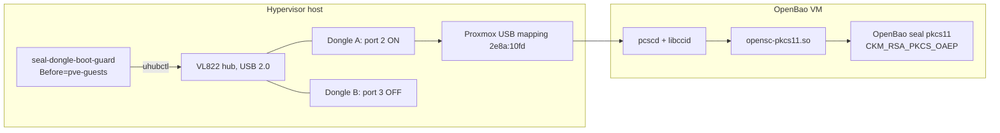

# openbao-picohsm-seal

CotS redundant FOSS HSM dongle for automatic OpenBao/Vault unseal. $20k security for $50.

## What it is

OpenBao auto-unseals against a PKCS#11 seal key held on a pico-hsm dongle,
an ESP32-S3 board running open firmware. Two dongles carry the same key on
a power-switchable USB hub, so a wedged or dead unit is replaced by a
command. This repo holds the firmware build, the failover scripts, the host
configuration and the key ceremony, as built for one homelab.

## How it works

The boot guard runs before guests start and sequences the hub: both ports
off, spare on, ATR probe, spare off, production on. Only one dongle is ever
powered, so the Proxmox VID/PID mapping (`2e8a:10fd`, shared by both units)
is unambiguous. Inside the OpenBao VM, pcscd and libccid expose the dongle
as a smart card reader, and opensc-pkcs11 is the module OpenBao loads. The
seal mechanism is `CKM_RSA_PKCS_OAEP` with SHA-256, the only mechanism the
dongle offers that OpenBao's seal accepts. An unseal costs about 16 seconds
at RSA-4096.

## The moving parts

| Directory | What it does | The non-obvious part |
|---|---|---|
| [`firmware/`](firmware/README.md) | Reproducible Docker build of pico-hsm v6.6 with three patches. | Button-gated rescue applet, correct LED GPIO, tinyusb pinned below 0.21.0. |
| [`failover/`](failover/README.md) | Boot guard, swap script and Proxmox USB mapping for the hypervisor. | The spare is ATR-probed on every boot. Every path in the guard exits 0: fail-open. |
| [`unseal-host/`](unseal-host/README.md) | Standard kernel, libccid VID/PID patch, pcscd and the seal stanza for the OpenBao VM. | The token label carries a `(UserPIN)` suffix. `SmartCard-HSM` and a bare `Pico-HSM` both fail. |
| [`ceremony/`](ceremony/README.md) | External keygen, DKEK wrap via scsh, import, and an on-device OAEP verify. | The DKEK share is transient. The PEM is what you keep. |

## Why these choices

**The key is generated off-device.** pico-hsm can generate keys on-device,
but then each dongle has a different key and a spare cannot stand in for
the production unit. Generating once with `openssl genrsa` and importing
the same PEM into both makes the spare a true drop-in. The PEM must be
escrowed; how is outside this repo.

**A physical spare, not a software fallback.** The dongle can wedge until
it is power-cycled (upstream issue #9, reproduced here). A hub with real
per-port VBUS switching turns "walk to the rack" into a command, and
powering the spare at boot is a free chance to verify it. The probe is an
ATR check, not USB enumeration, because a wedged dongle still enumerates.

**v6.6, not master.** Master has roughly 30 more security fixes on the
pre-authentication USB parsing surface (counted against commit
`1ad8444`), but its ESP32 build is broken upstream and its reorganised key
store fails import on a fresh device. v6.6 with three patches is the base
until upstream ships a release that imports.

## Requirements

Hardware:

- 2 × Waveshare ESP32-S3-LCD-1.47.
- 1 × VIA Labs VL822 USB hub.
- 2 × short USB-A extension cables.
- 1 × USB-A to USB-C adapter without USB 3. This forces the hub into
  USB 2.0 mode. The VL822 cuts VBUS only in that mode.
- A hypervisor with `uhubctl`, `opensc` and `pcscd`.
- An OpenBao VM, or the hypervisor itself, with `pcscd`, `opensc`,
  `libccid` and the OpenBao HSM build (`openbao-hsm_<version>_linux_amd64.deb`).

Workstation, for build and ceremony:

- Docker.
- `esptool` 5 or later.
- OpenSC: `sc-hsm-tool`, `pkcs11-tool`, `opensc-tool`.
- Java 17 or later.
- `scsh` 3.18.77. See [`ceremony/SCSH-PROVENANCE.md`](ceremony/SCSH-PROVENANCE.md).
- macOS, for the ceremony script's ramdisk.

## Bring-up order

1. Build the firmware. See [`firmware/`](firmware/README.md).
2. Take an eFuse baseline of each dongle. Then flash both.
3. Run the ceremony on each dongle, one connected at a time.
   See [`ceremony/`](ceremony/README.md).
4. Install the hub in USB 2.0 mode. Confirm VBUS drops on ports 2 and 3.
5. Deploy [`failover/`](failover/README.md) to the hypervisor. Set the
   three port variables.
6. Deploy [`unseal-host/`](unseal-host/README.md) to the OpenBao VM.
7. Put [`unseal-host/seal.hcl`](unseal-host/seal.hcl) into the OpenBao
   config.
8. Migrate the seal with
   [OpenBao's documented procedure](https://openbao.org/docs/concepts/seal/).

## Limitations

- About 16 seconds per unseal at RSA-4096; 3.7 seconds at RSA-2048.
- RSA-OAEP is the only mechanism. pico-hsm exposes no AES-GCM over
  PKCS#11.
- v6.6 is behind master on USB parsing fixes (see above).
- The ceremony ramdisk is macOS-only.
- Recovery from a wedge is a power cycle, which is why the hub exists.
- Two live copies of the key sit in one chassis.

## Security notes

- Stock v6.6 accepts an unauthenticated eFuse burn over USB (rescue applet
  INS `0x1D`). It can permanently brick the unit.
- The `FORCE_BUTTON_WAIT` build flag gates it behind a physical button
  press, and [`ceremony/rescue-apdu.sh`](ceremony/rescue-apdu.sh) refuses
  it on the workstation.
- The key is non-extractable from the dongle but is escrowed off-device.
  The escrow is the thing to protect.
- Check for CVEs and GitHub advisories against pico-hsm and pico-keys-sdk
  before deploying. None were published as of commit `1ad8444`.
- Report firmware issues upstream at
  https://github.com/polhenarejos/pico-hsm.

## Contributing · Security · License

- [`CONTRIBUTING.md`](CONTRIBUTING.md)
- [`SECURITY.md`](SECURITY.md)
- [`LICENSE`](LICENSE): MIT
